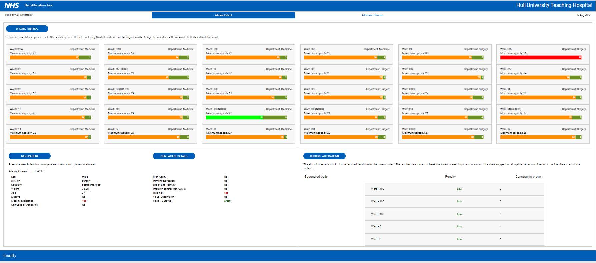

# HUTH_Bed_Allocation_Dashboard
 ##### Bed Allocation Decision Support Tool

> ML Project done in tandam with the [Hull University Teaching Hospitals NHS Trust - HRI](https://www.hull.nhs.uk/), as part of obtaining a Master’s degree in [Artificial Intelligence and Data Science at the University of Hull](https://www.hull.ac.uk/study/postgraduate/taught/artificial-intelligence-and-data-science-msc).

## Introduction

With the impact of the recent global pandemic, the increasing pressure on the NHS continues to widen with no end in sight. A new direction in the resource allocation decision-making process is crucial, as ‘business-as-usual’ is not an option. 

An exhaustive literature review presents a recent increase in the adoption of hybridized forecasting, simulation, and optimization procedure in suggesting the best healthcare resource management practices. In this regard, the [Hull University Teaching Hospitals NHS Trust - HRI](https://www.hull.nhs.uk/) considered the practicality and effectiveness of a recently developed [NHSx skunkworks-bed-allocation](https://github.com/nhsx/skunkworks-bed-allocation) PoC by the NHS AI team as a Decision-Support system in making bed allocation recommendations. 

This requires the PoC to be completely reconfigured to capture the operations of the Hospital, validate, and optimize the models with real data, explore alternative models towards improving accuracy relative to the acquired data and enhance the User Interface for easy operationality and Interpretability of results. 

Findings from this study confirmed that the best admission forecast depends on forecasting methods and intervals. Conclusively, the developed tool illustrated the benefit and capabilities of Artificial Intelligence in supporting hospital operations, with seamless integration into current practices towards improving patients’ and staff wellbeing.

***

ML-Dash repo focused on the development of a Decision Support Tool for Bed Allocation in an NHS hospital in Hull. The goal of this project is to leverage machine learning techniques and interactive visualization to aid in the efficient allocation of hospital beds, ultimately improving patient care and resource utilization.

## Data Protection

This project was subject to a Data Protection Impact Assessment (DPIA), ensuring the protection of the data used in line with the [UK Data Protection Act 2018](https://www.legislation.gov.uk/ukpga/2018/12/contents/enacted) and [UK GDPR](https://ico.org.uk/for-organisations/dp-at-the-end-of-the-transition-period/data-protection-and-the-eu-in-detail/the-uk-gdpr/). No data or trained models are shared in this repository.

## Features

- **Machine Learning Models**: The repository includes various machine learning models that have been trained on historical data to predict patient admission, discharge, and transfer patterns. These models form the core of the decision support tool.

- **Interactive Visualization**: ML-Dash has been enhanced with interactive visualization capabilities to provide an intuitive and user-friendly interface. The visualizations allow users to explore bed occupancy rates, predicted bed demand, and other relevant metrics.

- **Optimal Bed Allocation Recommendations**: Based on the predictions from the machine learning models and the current bed availability, the tool generates optimal bed allocation recommendations. These recommendations help hospital staff make informed decisions regarding bed assignments and transfers.

***
**User Interface**

## Setup and Installation

1. Create a virtual environment e.g. [venv](https://docs.python.org/3/library/venv.html)
2. For standard installation run `pip install .` from within the repo.

3. to launch the UI from your virtual environment, run `python app/run.py` which will listen on port 8888.

## Roadmap

The following features and improvements are planned for future releases:

- Integration with additional data sources to capture more comprehensive patient information.
- Enhancement of machine learning models for improved prediction accuracy.
- Implementation of automated notifications and alerts for critical bed allocation situations.
- Optimization of the tool's performance and scalability.
- Feedback mechanism for users to provide suggestions and report issues.

## Contributing

Contributions to the decision support tool are welcome! If you would like to contribute, please follow these guidelines:

- Fork the repository and create a new branch for your contribution.
- Make your changes and test them thoroughly.
- Submit a pull request clearly describing the changes you have made.

## License

This project is licensed under the MIT License. See the [LICENSE](LICENSE) file for more details.

## Contact

If you have any questions or suggestions regarding the decision support tool, please contact [darmhy.code@gmail.com](mailto:darmhy.code@gmail.com).

Thank you for your interest in our project! We look forward to your contributions.
